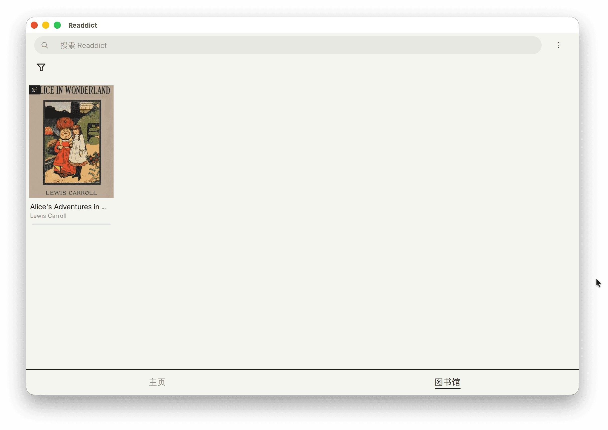
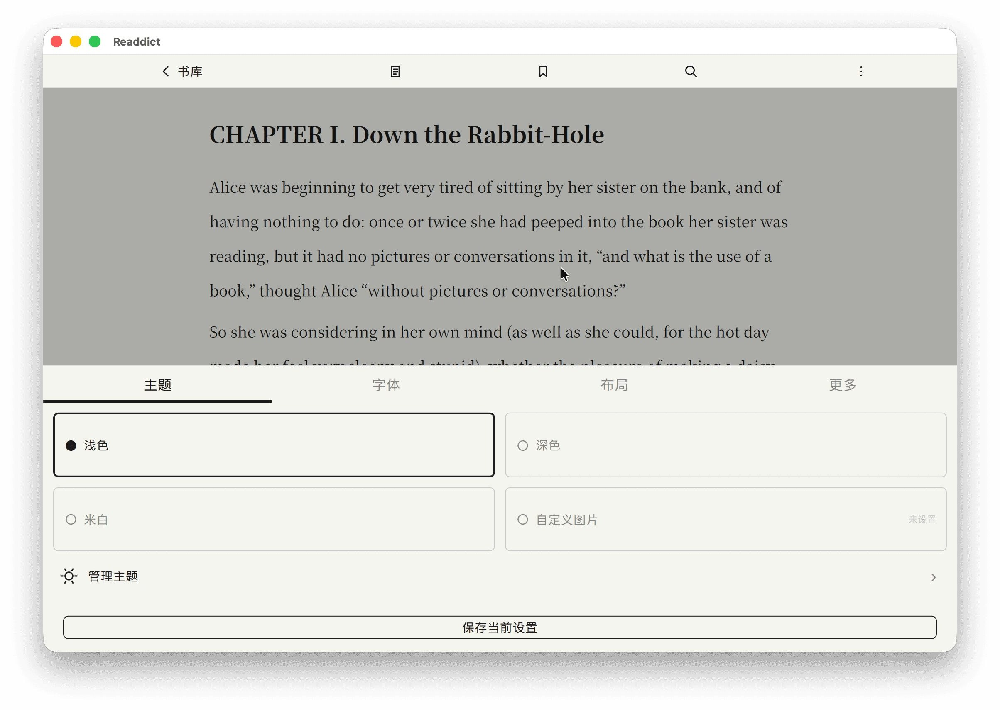
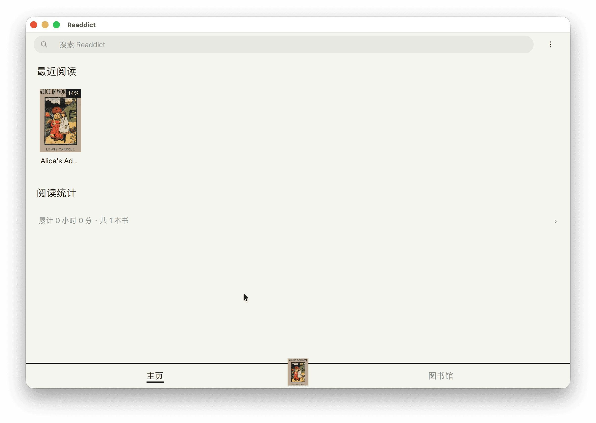
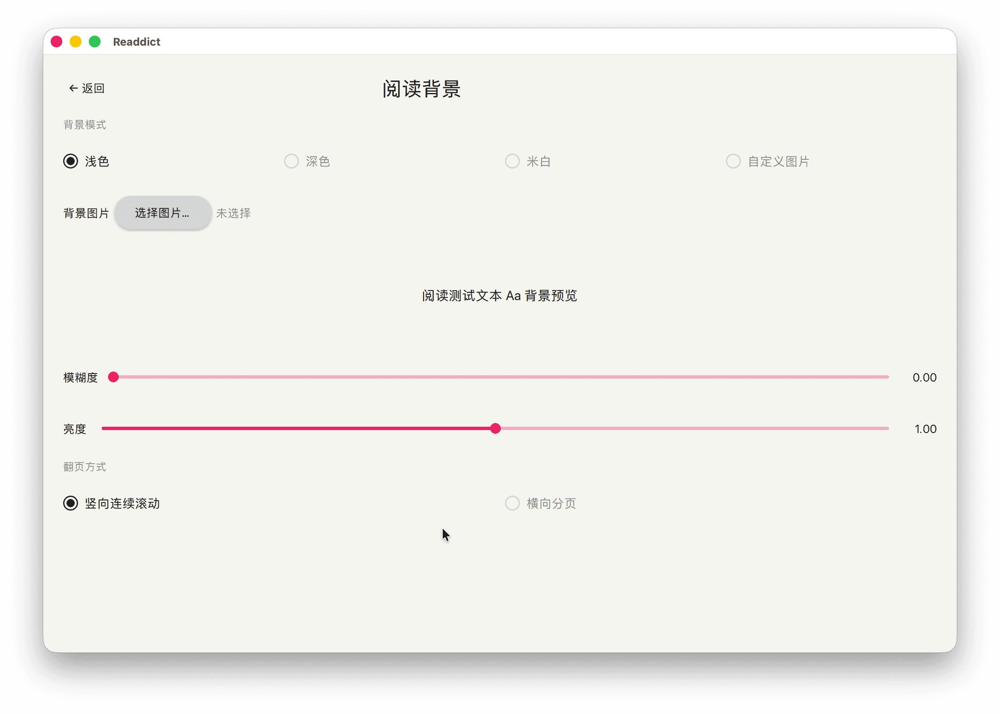

# Readdict · A modern, quiet open-source e-book reader

[简体中文](README.md) | **English**

[](LICENSE)
[](https://www.qt.io/)
[](#building-from-source)

Readdict is a desktop e-book reader built with **Qt 6 / QML**, focused on a calm, paper-like reading experience without distractions. It supports EPUB, MOBI/AZW3, FB2, TXT and PDF, with built-in text-to-speech (TTS), highlighting, WebDAV sync and flexible typography.

## Screenshots

| Library | Reader |
| --- | --- |
|  |  |

| Home | Background settings |
| --- | --- |
|  |  |

## Features

### 📚 Multi-format library
- Reads **EPUB / MOBI / AZW3 / FB2 / TXT / Markdown / PDF** — import and go
- Cover-wall library: covers, titles, authors and reading progress at a glance, with category filters and global search
- Home page gathers "Recently read" and reading statistics (total time, book count)

### 📖 Immersive reading
- **Themes**: light / dark / cream / custom image backgrounds, with blur and brightness controls
- **Typography**: bundled Source Han Sans & Serif (variable fonts) and Smiley Sans, adjustable font size and layout
- **Page flow**: continuous vertical scrolling or horizontal paging
- Table of contents, bookmarks and full-text search
- Highlights: select to highlight, delete from the toolbar, manage all marks in one place

### 🔊 Read aloud (TTS)
- System voices out of the box, or plug in any **OpenAI-compatible TTS API** for more natural voices
- Sentence-by-sentence highlighting while reading; PDF is supported via visual-coordinate overlays
- Adjustable speed and voice

### ☁️ Sync & local-first
- **WebDAV** sync works with any standards-compliant server (e.g. Nutstore)
- All data stays local; Windows supports a portable data directory

### 🌏 Internationalization
- Simplified Chinese / Traditional Chinese / English UI, generated at build time with Qt Linguist

## Building from source

### Requirements

| Dependency | Version |
| --- | --- |
| Qt 6 (open source is fine) | ≥ 6.11 |
| CMake | ≥ 3.21 |
| C++17 compiler | Clang / GCC / MSVC |

The Qt installation should include: `Core`, `Gui`, `Quick`, `QuickControls2`, `Sql`, `Network`, `Pdf`, `TextToSpeech`, `Multimedia`, `LinguistTools`. Third-party libraries (zlib, minizip, libmobi) are vendored as source snapshots under [`third_party/`](third_party/), so no separate installation is needed.

### Build steps (macOS)

```bash
# Point CMake at your Qt installation
export CMAKE_PREFIX_PATH="$HOME/Qt/6.11.1/macos"

cmake -B build -S . -DCMAKE_BUILD_TYPE=Release
cmake --build build --target Readdict

# Run
open build/Readdict.app
```

To produce a self-contained `.app` (with the Qt runtime and fonts embedded, ready to distribute):

```bash
cmake --build build --target deploy_script
# Output: build/Readdict.app
```

### Run tests

```bash
cmake --build build
ctest --test-dir build --output-on-failure
```

## Tech stack

- **Qt 6.11 / QML**: declarative UI with custom Material-style components
- **C++17 + CMake**: parsers, sync, TTS engines and the business core
- **Qt Test**: 24 test cases covering parsing, import, sync, highlights, TTS and more
- Bundled variable fonts and trilingual translations

## Acknowledgements

Readdict stands on the shoulders of these great open-source projects — many thanks:

| Project | Purpose | License |
| --- | --- | --- |
| [Qt](https://www.qt.io/) | Application framework (UI / PDF / TTS / multimedia / network) | LGPLv3 / GPLv3 |
| [libmobi](https://github.com/bfabiszewski/libmobi) | MOBI / AZW3 parsing | LGPL-3.0-or-later |
| [zlib](https://github.com/madler/zlib) | Compression | zlib License |
| [minizip](https://github.com/madler/zlib/tree/develop/contrib/minizip) (zlib contrib) | EPUB container unzip | Info-ZIP License |
| [Source Han Sans / Serif](https://github.com/adobe-fonts) | Bundled variable fonts | SIL OFL 1.1 |
| [Smiley Sans](https://github.com/atelier-anchor/smiley-sans) | Bundled font | SIL OFL 1.1 |
| [Project Gutenberg](https://www.gutenberg.org/) | Public-domain demo book in the screenshots | Public domain |

Thanks also to the Qt / QML community and the open-source reader projects that inspired this one.

## License

This project is released under the [**GNU General Public License v3.0**](LICENSE).

- You are free to use, study, modify and redistribute this project; derivative works must be licensed under GPL-3.0 as well.
- The open-source Qt releases used by this project are dual-licensed under **LGPLv3 / GPLv3**; the application links Qt dynamically and complies with the corresponding obligations. The Qt PDF module bundles [PDFium](https://pdfium.googlesource.com/pdfium/), whose third-party notices ship with the Qt documentation.
- Third-party sources and fonts under [`third_party/`](third_party/) and [`fronts/`](fronts/) keep their original licenses (see the table above) and are provided alongside this repository.

---

*Readdict — addicted to reading, not to notifications.* 📖
